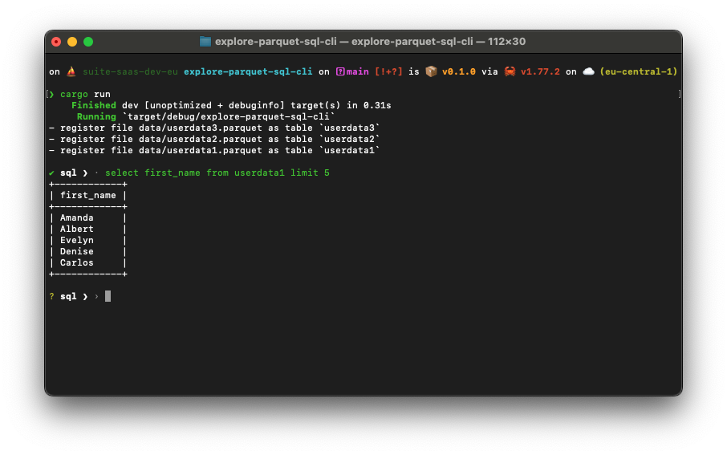

# Demo of running sql on parquet files

> This very demo is based on [this post](https://www.cloudnatively.com/query-parquet-files-with-datafusion/) and
> utilizes the data from there.



## Start

```sh
cargo run --locked
```

## Usage

You have now 3 tables available `userdata1`, `userdata2` and `userdata3`

Now you can interactively run sql queries like in a REPL.

- select only one column

```plain
sql ❯ select first_name from userdata3
```

- distinct select only one column

```plain
sql ❯ select distinct first_name from userdata3
```

- Union a projection of the different data tables

```plain
sql ❯ select distinct first_name from userdata3 union select first_name from userdata2 order by 1
```

- Substring matching

```plain
sql ❯ select * from userdata1 where first_name like '%ill%'
```